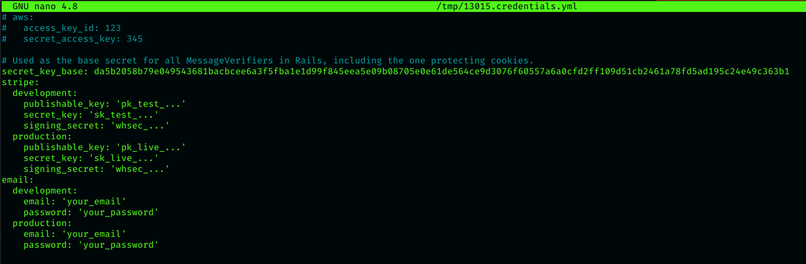
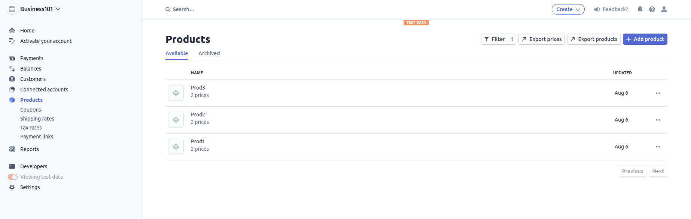
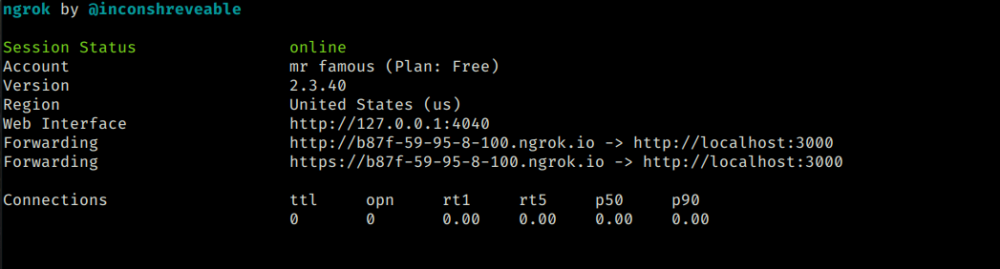

# Sample Rails app to study Stripe APIs

This simple app is built to understand how Stripe APIs can be used in our projects. It mainly focuses on backend operations.

* Ruby :diamonds: version: 2.6.0

* Rails :railway_track: version: 6.1.4

## Gems

* [StripeRails](https://github.com/tansengming/stripe-rails)

* [StripeEvent](https://github.com/integrallis/stripe_event)

## Prerequisites

* A [Stripe](https://stripe.com/en-in) Account.

* [Ngrok](https://ngrok.com/download) Setup (To test webhooks).

## Features of App

* Signup/Login :closed_lock_with_key:

* Buy :shopping_cart: multiple products/single subscription

* Check history :hourglass: of successful payments

* Cancel :warning: subscription

* Hosted Portal

* Download Receipt/Invoice :receipt:

## Application Setup

* Clone this repository

* Run the command: `EDITOR=nano rails credentials:edit`

* You will see the following:

* Paste your public and secret keys ( Do not worry about signing_secret for now ) from Stripe dashboard into the editor.

* Also add your email and password in the credentials file.

* Update your public key in [client.js](./public/js/client.js) (At the very beginning) file as well.

* Go to your Stripe Dashboard and create products. Eg: 
 

* For subscription plans you can use same products with recurring price.

* Grab id of each price and place them in [index.html.erb](./app/views/welcome/index.html.erb) ( Replace "price..." with your price id ).

***`NOTE`** **: Do not paste product_id, you must paste price_id of each product in the above mentioned index file***

## Webhooks Setup

In this app we are going to setup webhook for the event invoice.paid i.e when a payment is completed an event will be triggered and you will get an email saying "Order Successful".

* Run the command `./ngrok http 3000`

* You will see something like this:

* Copy the "https://..." link and got to Stripe [webhooks dashboard](https://dashboard.stripe.com/test/webhooks)

* Add the endpoint using the previously copied link and by selecting `invoice.paid` in events.

* In the endpoint you can add an entrypoint i.e if https://some-numbers-here.ngrok.io is the link, you can have entrypoint at https://some-numbers-here.ngrok.io/webhooks

* Now copy signing_secret of that webhook and paste it in your credentials file by running the command `EDITOR=nano rails credentials:edit`

## Starting the server

* Run the server using command `rails s`

## **That's it!! You are all set to carry out your transactions :tada::tada::tada:**
